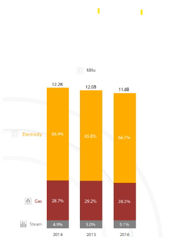

# 458 proposal revision

## Project idea, significance, and broader impact
Our group’s project idea is to create an interactive web map that displays the energy usage by neighborhood in Seattle before and after the covid-19 pandemic. The significance behind our project is to take a deeper look at energy usage within the growing city. Greenhouse gas emissions have become a substantial issue globally, especially emissions through the burning of fossil fuels. As we move toward a more sustainable future, it is important to look at energy usage and how much greenhouse gas is being emitted due to it. During the pandemic, the world was pushed inside, increasing energy usage as a whole. We want our maps to display how drastic this change might be and how this may shift the way households view their energy usage/ conservation efforts. In addition, we want the maps to help individuals living within the city to better understand which areas have higher energy consumption and how this might connect with the growth of Seattle. A negative impact that may come from our project is depending on the results from the maps, there could be some targeting of certain areas that may use more energy than others due to larger buildings (such as apartment complexes) or higher number of buildings within a neighborhood. In addition, due to many areas in Seattle facing gentrification, there is an abundance of apartment complexes in low income neighborhoods. Since neighborhoods are not all the same in types of buildings and the number of buildings, some may have significantly higher energy usage. We could avoid this issue by displaying the number of buildings or households in our map as either a pop up or shown from hovering. This will take into account the number of people living within a neighborhood and will not create a negative association.

## Primary function
The primary function of our web map is to display the energy usage within Seattle by neighborhood. We want our map to help the audience visualize the amount of energy that a growing city is using and educate them about whether it is sustainable. In addition, while viewing the map, we want the audience to take into consideration their own energy conservation methods and their efforts in reducing greenhouse gas emissions whether or not they live in Seattle. We want our web map to be able to display two time periods (pre and post covid) using a menu to switch between the periods and compare. We also want our map to display information on household/ building count through hovering or clicking on a neighborhood.     

## Major Data Sources
All our data that we will be using will be sourced from Seattle Geodata. Some datasets we will use are:  
All datasets (2015-2020) along with seattle climate reports
https://www.seattle.gov/environment/climate-change/buildings-and-energy/energy-benchmarking/data-and-reports#individualbuildingdata
 
Building Energy Benchmarking (2020)
https://data.seattle.gov/dataset/2020-Building-Energy-Benchmarking/auez-gz8p
 
Performance ranges (another set for energy usage from yr 2015)
https://data.seattle.gov/dataset/Performance-Ranges-By-Building-Type-2015/pqdh-4i9k
 
Neighborhood boundaries/ districts
https://data-seattlecitygis.opendata.arcgis.com/datasets/SeattleCityGIS::neighborhood-map-atlas-districts/explore?location=47.614546%2C-122.336918%2C12.29
 
 

## Multimedia:
This short [Youtube video](https://www.youtube.com/watch?v=7itJt8c0V8M)—Youtube Video: Cities and Rising Energy Consumption 101—introduces and emphasizes why energy consumption is so important to our lives especially in cities. cities are responsible for 80% of the world's energy consumption.A large amount of energy consumption also means a large carbon emission. Emissions are not only an environmental problem, but also a health problem. Over six million premature deaths per year are attributable to air pollution. Also, the video presents several ways for cities to reduce their energy consumption. From this introductory video, we hope that users can learn why energy consumption is so crucial for our lives, especially for residents who live in metropolitan areas such as Seattle. The video raises users’ awareness of energy consumption, and therefore connects to our project, Seattle energy consumption. 

Image: Energy consumption analysis from 2014 - 2016  

 

In Seattle, from [2014 to 2016](https://www.energy.gov/eere/slsc/downloads/seattle-energy-benchmarking-analysis-report), the total weather-normalized energy consumption declined for three consecutive years, from 12,2 billion kBtu in 2014 to 11.8 billion kBtu in 2016. Overall, it shows that buildings are more energy efficient, and a downward trend of total energy consumption. However, the pandemic could be an uncertainty in this downward trend, and we are going to find out if the energy consumption will keep decreasing, or the pandemic has negatively impacted on energy consumption which means total energy consumption increased during the pandemic. 

## Target Audience
Our targeted audience for this project would be both businesses in Seattle, or those exploring possibly relocating to the area, as well as current residents of the city, and Seattle residents.  Since we visualize the electricity and natural gas consumption in the Seattle area before and after the pandemic, the project will help Seattle residents to compare and contrast the impact of the Covid-19 pandemic around their homes or working places. Understanding how Covid-19 impacted energy usage trends can be important for businesses wanting to gain a more thorough understanding of what financial impacts Covid-19 may have on them.  This project will also allow for current residents of the city to have a better understanding of how Covid-19 altered energy consumption habits inside homes and what impact that may have on themselves personally and throughout their community during the pandemic and moving forward. Energy consumption is a significant expenditure for households and businesses, so people may want to find out the impact of Covid on energy consumption, and what it is going to cost in future as the pandemic is still not over. 

Journal Article: Impacts of the COVID-19 lockdown on building energy consumption and indoor environment: A [case study in Dalian, China](https://www.ncbi.nlm.nih.gov/pmc/articles/PMC8959662/)The article studies the influence of the Covid-19 pandemic on a large green commercial building in Dalian, China. The study found out that the first lockdown in Dalian caused 65% drop in monthly energy consumption, and 55% drop in the second lockdown. It is obvious that the pandemic had a great impact on building’s energy consumption. Although the policies against the spread of Covid-19 in the U.S. are largely different than in China, it is still very possible that the pandemic had a great impact on the energy consumption in Seattle. Therefore, comparing and contrasting energy consumption pre and post Covid can be really useful. 

## Project Format

* Projection 4326
* Zoom levels 2 - 14 since the focus is on the neighborhoods of Seattle, will require some zooming in
* Center of map view = around Green Lake Park (47.68032911477562, -122.3275283846573)
* The base map will be a darker, greyer theme in order to emphasize the lighter green to red tones that will be used for classifying the energy usage spectrum. (either Moonlit or Dark Theme from Mapbox)
* Choropleths will be made to highlight the various neighborhoods within Seattle based on the aggregate energy consumption of each boundary in a neighborhoods shapefile
both provided by seattle.gov arcGIS database, datasets on energy usage per parcel and also one for the boundary polygons of Seattle neighborhoods
* Raster layer, I believe the shown screenshot would be a good bounding box to capture an integral part of Seattle in terms of energy usage—with Green Lake as center

* For interactivity, there will be a small window with buttons where the user will be able to switch between electricity and natural gas usage.
* Furthermore, a pulldown menu will allow the user to change the year that is being viewed.
There will be a navbar available at the top of the page to navigate between home, about, and map page.
